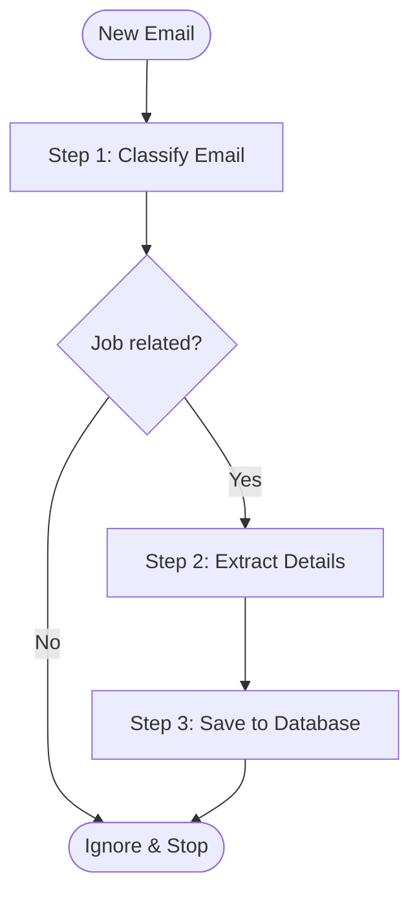

# Job Tracker

Job Tracker connects to your Gmail inbox, reads job-related emails, and organizes them into a clean dashboard.

Instead of manually updating a spreadsheet, the app automatically detects when you apply for a job or receive an update (test invite, interview schedule, rejection, or offer). It extracts the company, role, interview links, deadlines, and notes, and updates your dashboard in real time.

---

## What It Does

1. **Monitors your inbox**: Listens for new emails arriving in your Gmail.
2. **Filters out noise**: Ignores newsletters, spam, and personal emails, processing only job-related emails.
3. **Pulls out key information**: Extracts the company name, role, status, meeting/test links, and deadlines.
4. **Groups emails by job**: If you get 3 emails from the same company (e.g. Applied -> OA -> Interview), it keeps them under one application card with a chronological timeline.
5. **Dashboard**: Shows your active applications, current stages, deadlines, and one-click buttons to join interviews or take tests.

---

## LangGraph Workflow

The email analysis logic is in `backend/app/graph/graph.py`. It uses LangGraph to run emails through a simple 3-step pipeline:



### Step 1: Classify (`classify_email`)
* Checks if the email is actually related to a job application.
* If it is junk, spam, or a generic newsletter, the workflow stops immediately to save LLM tokens.
* If it is a job email, it passes it to Step 2.

### Step 2: Extract (`extract`)
* Reads the subject and body to extract:
  * **Company**: Company name.
  * **Role**: Job title.
  * **Status**: Current stage (`APPLIED`, `UNDER_REVIEW`, `OA`, `INTERVIEW`, `OFFER`, `REJECTED`).
  * **Summary**: A short 1-2 sentence explanation of what the email says.
  * **Action Link**: Interview link (Zoom, Google Meet, Teams), coding test link (HackerRank, CodeSignal), or candidate portal link.
  * **Event Date**: Any scheduled interview date/time or test submission deadline.

### Step 3: Save (`persist`)
* Checks the database for an existing application with the same company and role.
  * **If found**: Updates the status, saves the latest notes and links, and adds a new entry to the application's timeline.
  * **If new**: Creates a new application record using the date the first email was received.

---

## How Emails Reach the App

1. When an email arrives, Gmail sends a lightweight ping to a Google Cloud Pub/Sub topic.
2. Pub/Sub forwards the ping to your local backend webhook via ngrok.
3. The backend checks Gmail for the new message and downloads its text.
4. The message runs through the LangGraph workflow.
5. The result is saved to SQLite and appears on the React dashboard.

---

## Tech Stack

* **Backend**: Python, FastAPI, Uvicorn
* **AI & Workflow**: LangGraph, LangChain, Pydantic
* **LLM**: `mimo-v2.5` (via OpenCode endpoint)
* **Database**: SQLite with SQLModel
* **Email**: Gmail REST API, Google Cloud Pub/Sub, OAuth 2.0
* **Frontend**: React, TypeScript, Vite, React Router, CSS

---

## Setup and Installation

### Prerequisites
* Python 3.11+
* Node.js 18+
* Google Cloud project with Gmail API and Cloud Pub/Sub API enabled
* ngrok (for local webhook forwarding)

---

### 1. Backend Setup

```bash
cd backend

# Create virtual environment
python3 -m venv .venv
source .venv/bin/activate

# Install dependencies
pip install -r requirements.txt
```

Create a `.env` file in `backend/`:

```env
GMAIL_CREDENTIALS_PATH=credentials.json
GMAIL_TOKEN_PATH=token.json
GMAIL_PUBSUB_TOPIC=projects/<your-project-id>/topics/<your-topic-name>

DATABASE_URL=sqlite:///./job_tracker.db

OPENCODE_API_KEY=your_api_key_here
OPENCODE_SESSION_ID=your_session_id
```

Put your Google OAuth `credentials.json` inside the `backend/` directory.

---

### 2. Frontend Setup

```bash
cd frontend
npm install
```

---

### 3. Running the Project

Open 3 terminal tabs:

**Terminal 1 — Backend:**
```bash
cd backend
source .venv/bin/activate
uvicorn app.main:app --reload --port 8000
```

**Terminal 2 — ngrok Tunnel:**
```bash
ngrok http 8000
```
> Set your Google Cloud Pub/Sub push subscription endpoint to: `https://<your-ngrok-subdomain>.ngrok-free.app/gmail/webhook`

**Terminal 3 — Frontend:**
```bash
cd frontend
npm run dev
```
Open `http://localhost:5173` in your browser.

---

### 4. Connect Gmail

1. Open `http://localhost:5173/settings`.
2. Click **Connect Gmail** to finish the one-time Google OAuth login.
3. Click **Register Watch** to start receiving inbox notifications.
4. (Optional) Click **Full Sync** to pull in your existing recent application emails.

---

## Important Things to Keep in Mind

* **7-Day Watch Expiry**: Google limits Gmail push watches to 7 days. Click **Register Watch** in the Settings tab once a week.
* **ngrok Restarts**: Free ngrok gives you a new URL whenever restarted. Update the push endpoint in Google Cloud Pub/Sub when that happens.
* **Offline Catch-Up**: If your computer was asleep or off, click **Full Sync** on the Settings page to fetch any emails received while offline.
* **OAuth Test Mode**: If your Google Cloud OAuth consent screen is in "Testing" mode, Google expires refresh tokens after 7 days. Setting the consent screen to "In production" prevents this.
