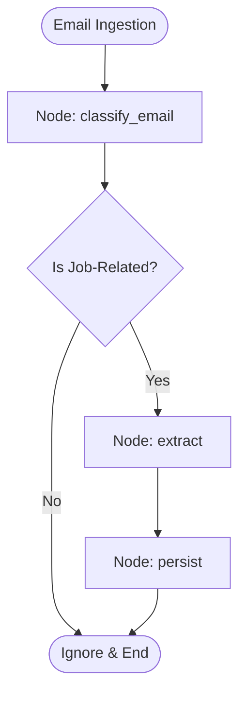
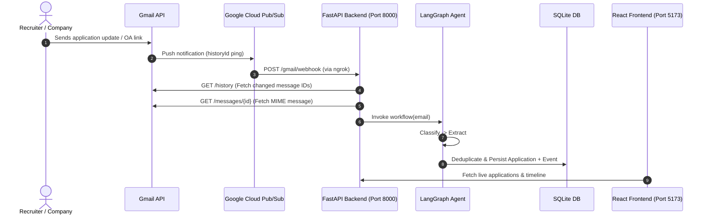

# 📬 Job Tracker

An autonomous, AI-powered job application tracker that automatically monitors your Gmail inbox, analyzes recruiter emails using a **LangGraph** multi-step workflow, extracts key application data (company, role, status, interview links, deadlines), and organizes everything into an interactive dashboard.

No more manual spreadsheets or missed interview invites.

---

## 💡 What It Does (In Simple Terms)

1. **Watches Your Inbox**: Whenever you apply to a company or receive an update (acknowledgment, OA invite, interview schedule, rejection, or offer), Gmail pings the application.
2. **AI Filters & Extracts**: A LangGraph agent inspects the email. It filters out irrelevant inbox noise, then extracts the company name, role, interview/test links, deadlines, and a concise summary note.
3. **Connects the Dots**: Instead of creating duplicate entries for every email, it matches emails from the same company & role, updates the application's current stage, and logs a chronological event to your application's timeline.
4. **Actionable Dashboard**: You get a clean dark-mode interface displaying your active applications, current statuses, upcoming test deadlines, and direct one-click buttons to join interviews or open assessments.

---

## 🧠 LangGraph Workflow

The intelligence of the system lives in `backend/app/graph/graph.py`, built using **LangGraph** and structured LLM outputs.



### 1. State: `ApplicationState`
The graph passes a shared state across all nodes:
* `email_subject`, `email_body`: The email text and headers.
* `source_email_id`, `sender_email`, `received_at`: Metadata from Gmail.
* `is_application_email`: Boolean flag set by classification.
* `company`, `role`, `status`: Core application fields.
* `summary`, `action_url`, `event_date`: Rich extracted details (notes, links, deadlines).
* `application_id`: ID of the persisted record in the database.

### 2. Node: `classify_email`
* **Purpose**: Fast, cost-efficient filtering.
* **Logic**: Evaluates whether the email relates to a job application (confirmation, OA, interview, offer, rejection).
* **Routing (`should_process`)**:
  * If `False` → routes immediately to `END`. Saves tokens and prevents junk from cluttering your tracker.
  * If `True` → routes to `extract`.

### 3. Node: `extract`
* **Purpose**: Structured information extraction.
* **Extraction Schema (`ApplicationExtraction`)**:
  * `company`: Company name.
  * `role`: Job title or position applied for.
  * `status`: Lifecycle stage (`APPLIED`, `UNDER_REVIEW`, `OA`, `INTERVIEW`, `INTERVIEW_PASSED`, `INTERVIEW_REJECTED`, `OFFER`, `REJECTED`).
  * `summary`: 1–2 sentence summary explaining the update or required action.
  * `action_url`: Primary link (Zoom/Google Meet/Teams invite, HackerRank/CodeSignal test, or scheduling calendar).
  * `event_date`: Specific interview schedule or test submission deadline.

### 4. Node: `persist`
* **Purpose**: Idempotent database storage.
* **Logic**:
  * Searches SQLite for an existing application with matching `company + role`.
  * **If found**: Updates the application's status, updates latest notes/links, and records a new event in `ApplicationEvent` (timeline).
  * **If new**: Creates a new `Application` record with `applied_at` set to the timestamp of the first email received.

---

## ⚡ Architecture & Real-Time Sync



### Multi-Layer Deduplication
1. **Webhook Watermark**: Ignores duplicate or out-of-order Pub/Sub notifications using stored `historyId`.
2. **Pre-LLM Check**: Checks SQLite for `source_email_id` before invoking the model to save tokens.
3. **Application Deduplication**: Matches normalized `company + role` to prevent multiple cards for the same job.
4. **Database Constraint**: Hard unique constraint on `source_email_id` to prevent race conditions.

---

## 🛠 Tech Stack

| Layer | Technology |
|---|---|
| **Agent / Workflow** | LangGraph, LangChain, Pydantic Structured Outputs |
| **LLM** | `mimo-v2.5` (via OpenCode endpoint) |
| **Backend Framework** | FastAPI (Python 3.11+), Uvicorn |
| **Database & ORM** | SQLModel (SQLAlchemy 2.0) + SQLite |
| **Email Ingestion** | Gmail REST API v1, Google Cloud Pub/Sub, OAuth 2.0 (PKCE) |
| **Frontend** | React 18, TypeScript, Vite, React Router 6 |
| **Styling** | Vanilla CSS (Custom dark mode design system) |

---

## 🚀 Getting Started

### 1. Prerequisites
* Python 3.11 or higher
* Node.js 18 or higher
* A Google Cloud Project with the **Gmail API** and **Cloud Pub/Sub API** enabled
* [ngrok](https://ngrok.com/) (to tunnel Pub/Sub webhooks to your local server)

---

### 2. Backend Setup

```bash
cd backend

# Create and activate virtual environment
python3 -m venv .venv
source .venv/bin/activate

# Install dependencies
pip install -r requirements.txt
```

#### Configure Environment (`backend/.env`):
```env
# Google OAuth & Pub/Sub
GMAIL_CREDENTIALS_PATH=credentials.json
GMAIL_TOKEN_PATH=token.json
GMAIL_PUBSUB_TOPIC=projects/<your-gcp-project-id>/topics/<your-topic-name>

# Database
DATABASE_URL=sqlite:///./job_tracker.db

# LLM Configuration
OPENCODE_API_KEY=your_api_key_here
OPENCODE_SESSION_ID=your_optional_session_id
```

Place your downloaded OAuth `credentials.json` inside the `backend/` directory.

---

### 3. Frontend Setup

```bash
cd frontend
npm install
```

---

### 4. Running Locally

You need three terminal processes running:

**Terminal 1 — Backend:**
```bash
cd backend
source .venv/bin/activate
uvicorn app.main:app --reload --port 8000
```

**Terminal 2 — Tunnel (ngrok):**
```bash
ngrok http 8000
```
> Copy your ngrok URL (e.g. `https://xyz.ngrok-free.app`) and configure your GCP Pub/Sub push subscription endpoint to `https://xyz.ngrok-free.app/gmail/webhook`.

**Terminal 3 — Frontend:**
```bash
cd frontend
npm run dev
```
Open `http://localhost:5173` in your browser.

---

### 5. First-Time Authorization & Gmail Watch

1. Navigate to the **Settings** tab in the dashboard (`http://localhost:5173/settings`).
2. Click **Connect Gmail**: Authorize your Google account via OAuth consent.
3. Click **Register Watch**: Subscribes your Gmail inbox to your Google Cloud Pub/Sub topic.
4. Click **Full Sync** (optional): Immediately pulls recent emails to backfill your existing applications.

---

## 📌 Important Notes & Operational Tips

* **7-Day Gmail Watch Expiry**: Google caps Gmail push watches at 7 days. Click **Register Watch** in the Settings tab once a week (or automate it via cron).
* **ngrok Restarts**: If you are on free ngrok, restarting the terminal creates a new URL. Remember to update your Google Cloud Pub/Sub Push Subscription endpoint.
* **OAuth Test Mode**: If your Google Cloud project is in 'Testing' mode, Google expires refresh tokens after 7 days. Switch your OAuth Consent Screen status to 'In production' to keep credentials active.
* **Offline Catch-Up**: If your laptop is asleep or backend is offline, you will not lose emails. Once online, click **Full Sync** on the Settings page to catch up.

---

## 📄 License
MIT
